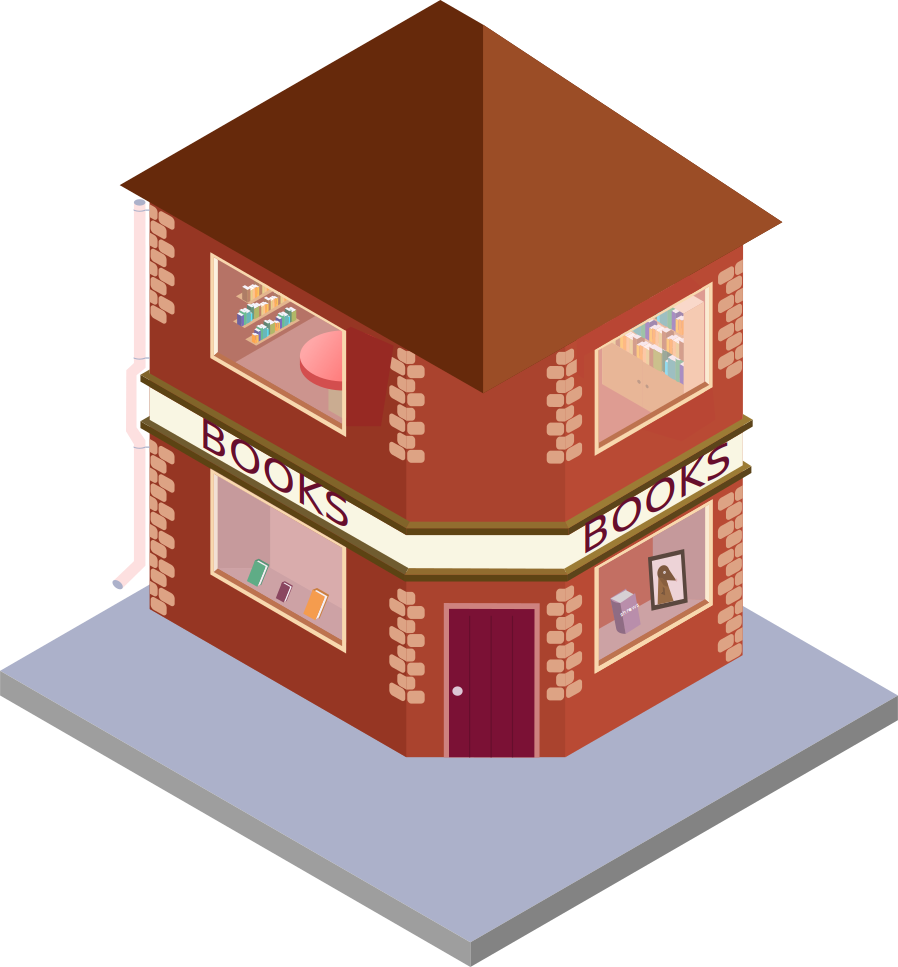
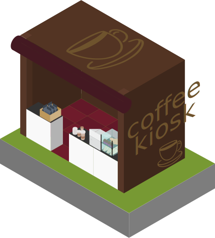

# Welcome to my little corner of the world

Hi, I'm Todd Cao.

This website is where I collect the things that keep me curious: research, teaching, marketing, business, and the guitar riff.

By day, I teach and conduct research. My work explores how people think, choose, and interact with artificial intelligence. Along the way, I have been fortunate to earn a PhD in Management from the University of Southern Queensland and am completing a second PhD in Business Administration at Open University, Vietnam.

Over the years, I have taught courses ranging from Business and Management Fundamentals to Marketing, Public Relations, Crisis Management, and Media Audience Research. I enjoy helping students connect theory with the messy realities of the world outside the classroom.

Feel free to wander around. You will find my research, teaching materials, projects, and a few stories from the journey.

# Please explore my little world

```{=html}
<div class="city-wrapper">
  <div class="city-layer">

    

    <a href="about.html" class="city-icon icon-home">
      
      <span class="city-label">About me</span>
    </a>

    <a href="about.html#contact" class="city-icon icon-contact">
      
      <span class="city-label">Contact</span>
    </a>

    <a href="3_Research.html" class="city-icon icon-research">
      
      <span class="city-label">See what I'm capable of</span>
    </a>

    <a href="4_Teaching.html" class="city-icon icon-talks-workshops">
      
      <span class="city-label">Teaching</span>
    </a>

    <a href="2_Publications.html" class="city-icon icon-bookshop">
      
      <span class="city-label">Here are my publications</span>
    </a>

    <a href="#" class="city-icon icon-open-science">
      
      <span class="city-label">Open Science</span>
    </a>

    <a href="6_Freelance.html" class="city-icon icon-illustration">
      
      <span class="city-label">Freelance projects</span>
    </a>

    <a href="#" class="city-icon icon-radio">
      
      <span class="city-label">Media & Interviews</span>
    </a>

    <a href="5_Achievements.html" class="city-icon icon-blog">
      
      <span class="city-label">Achievements</span>
    </a>

    <a href="8_Contact.html" class="city-icon icon-coffee">
      
      <span class="city-label">Contact me</span>
    </a>

  </div>
</div>
```