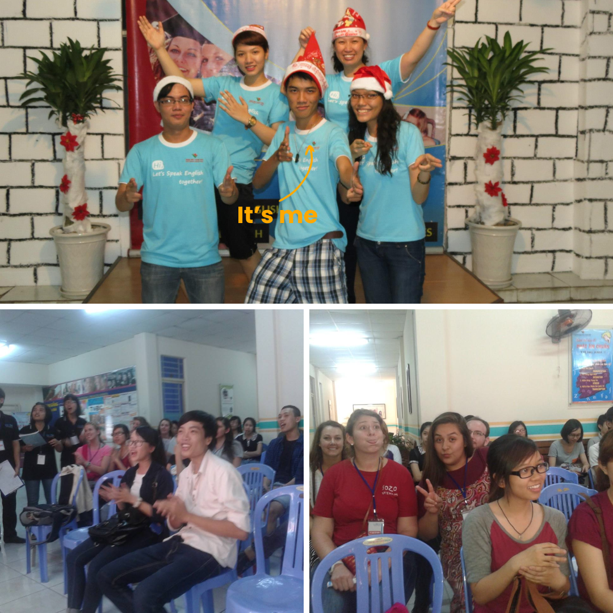
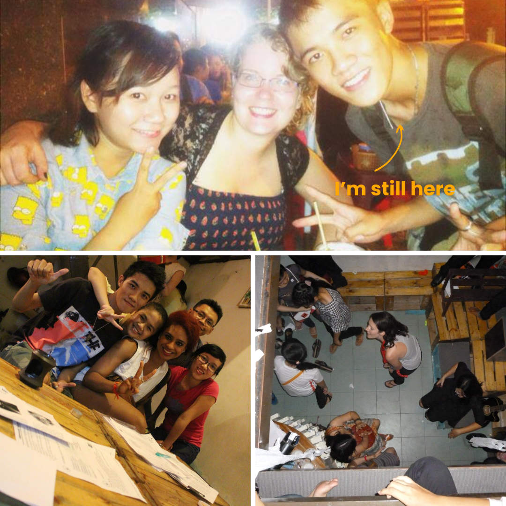
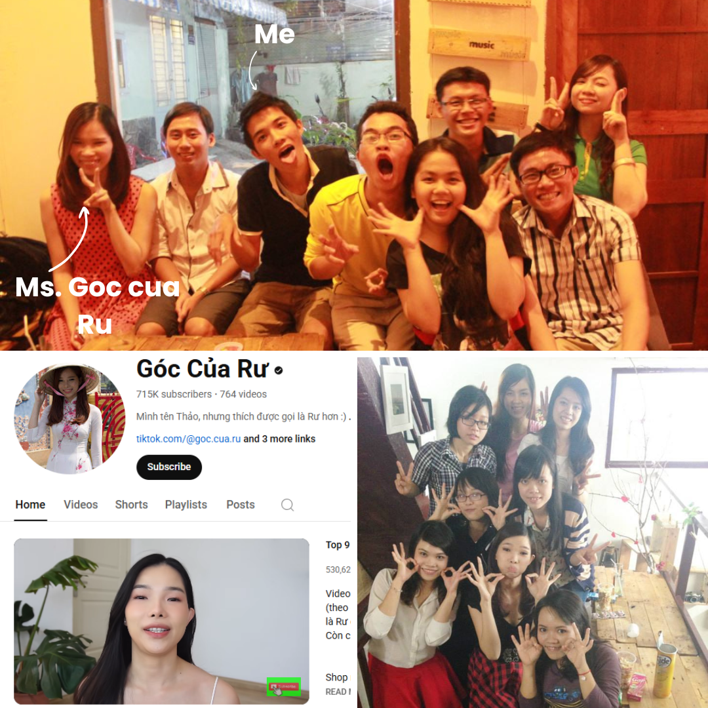
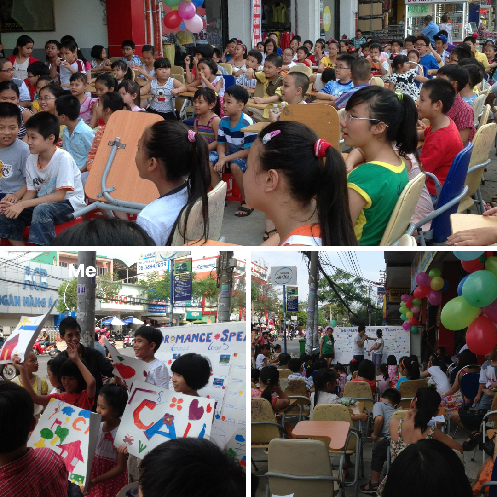
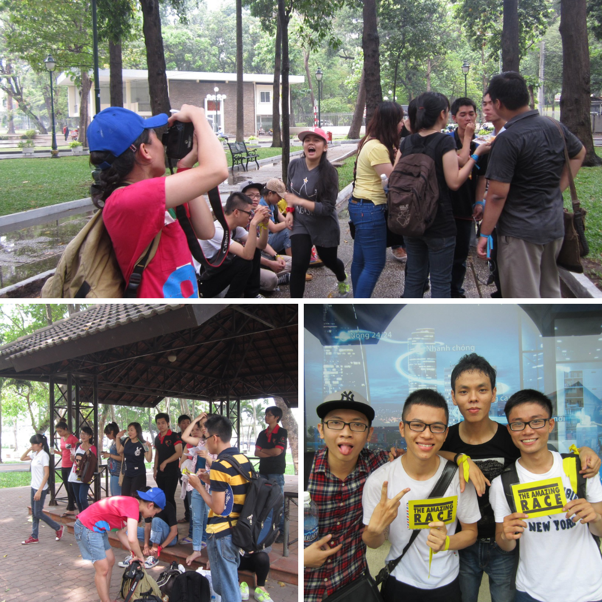
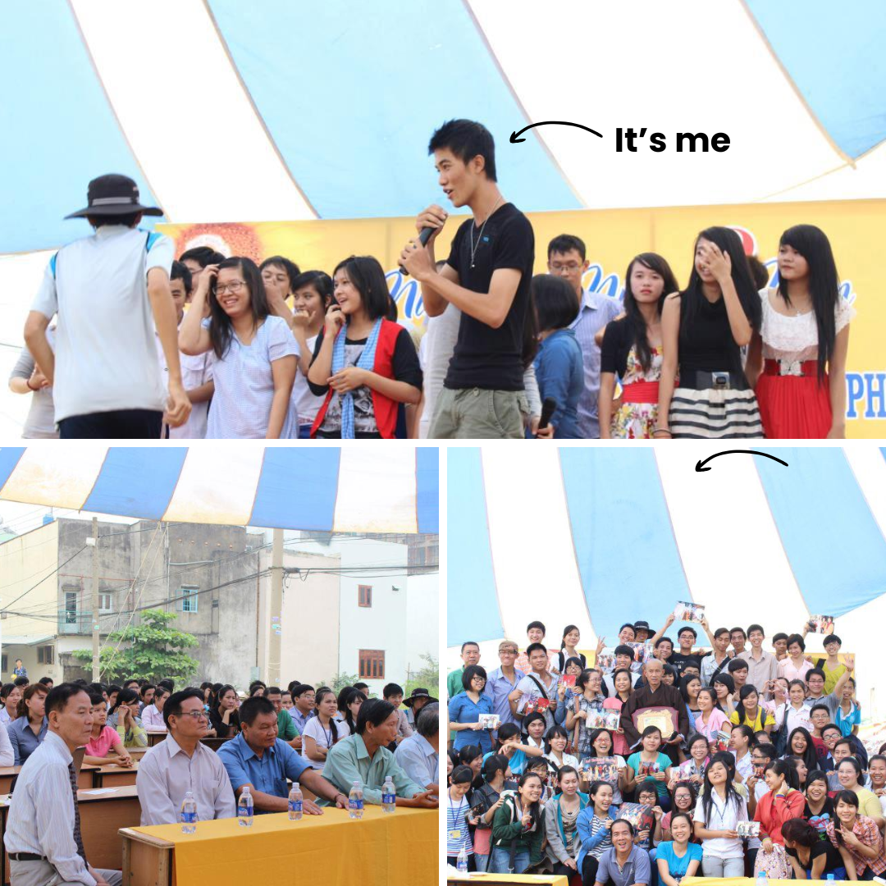
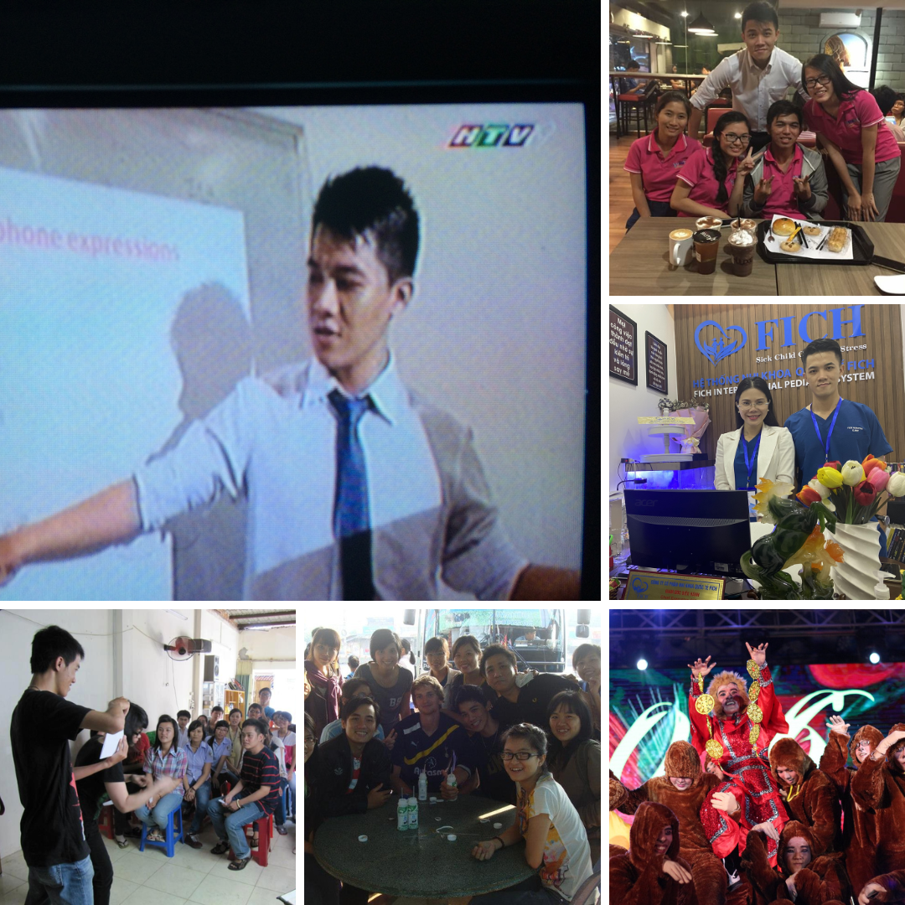

During my student years, I worked on several freelance projects. Each one taught me something new about creativity, teamwork, and responsibility. Here are a few snapshots from that journey.

## First Project {#freelance}

In 2011, while studying at an English center, I could only afford the first month of tuition. Instead of giving up, I proposed an idea to the center manager: I would build a student speaker team to help others practice English before and after their classes. In return, I continued learning for free and received a small stipend of 600,000 VND (about 21 USD/month). What began with 3 members grew into a 20-member team by 2013, achieving a 4.5 out of 5 student satisfaction rating. This experience taught me how to market my skills and manage a project that created real value [(Figure 1)](#yume).

{#yume width="60%" fig-align="center"}

## Second Project

In 2012, I met Quang, a mentor who taught me how to manage a team. Through him, I joined a project with Mr. Lu, founder of Lu Cuffee, where I worked until 2015. My role was to coordinate international volunteers who joined via Couchsurfing.com — from Indonesia, China, France, the Philippines, and beyond [(Figure 2)](#lu). In exchange for accommodation, they worked each night as communicators with Vietnamese customers. Leading this diverse group taught me how to manage across cultures, build trust, and create teamwork among people from very different backgrounds.

{#lu width="60%" fig-align="center"}

## Third Project

In 2014, I began earning from freelance marketing by working with the beauty vlogger Góc của Rư, who now has more than 715,000 YouTube subscribers [(Figure 3)](#ru). My role focused on offline activities such as creating agendas for her fan meetings and makeup classes. Her fame was already well established by the time I joined her team, and while my contribution was modest, I became a small but important link that helped her events run smoothly.

{#ru width="60%" fig-align="center"}

## Fourth Project

From late 2014 to 2015, I began organizing my own marketing events. One of my first was for Cali elementary school, where I hosted an outdoor event with nearly 80 guests [(Figure 4)](#cali). I coordinated outsourced partners including a music band and an MC, and worked with the police to secure the event permit. The event was a success, and the school owner, pleased with the outcome, entrusted me with two more events at her other campuses in Go Vap and Thu Duc Districts.

{#cali width="60%" fig-align="center"}

## Fifth Project

In April 2015, I noticed the growing trend that many Vietnamese people loved practicing English by talking with foreigners. Inspired by this, I created a local version of the “The Amazing Race” and sold tickets for 600,000 VND (about 29 USD) to 24 participants [(Figure 5)](#race). They were divided into 4 teams and challenged to solve quizzes that led them to 5 different locations across Ho Chi Minh City. Along the way, they had to team up with foreigners to complete the challenges. This campaign not only gave participants a fun and meaningful experience but also became a stepping stone that later helped me enter larger companies.

{#race width="60%" fig-align="center"}

## Sixth Project

In 2015, I became the lead organizer for the 5-year anniversary of the non-profit language center Leaf Pagoda. I managed everything from planning and preparation to on-the-day coordination, including handling unexpected issues to keep the event running smoothly. This experience gave me the confidence to manage large-scale events from start to finish [(Figure 6)](#leaf).

{#leaf width="60%" fig-align="center"}

## Other Projects

Beyond these six projects, I also ran several others, for example, working as a teacher on TV, helping a clinic attract investment, managing a fast-food store, and directing a stage play. These experiences strengthened my confidence in creating campaigns and collaborating with people from diverse backgrounds [(Figure 7)](#others). They shaped my ability to think like an entrepreneur, act as a manager, and deliver results. I may not be perfect, but I always strive to make my work meaningful and beautiful.

{#others width="60%" fig-align="center"}

One standout project was directing the stage play “Wukong Re-Spring.” I positioned the play as a fresh take on a classic story, led a diverse creative team, and turned vision into execution that resonated with the audience. The result? We won a 5,000 USD prize — proof that I can design experiences that inspire, engage, and deliver measurable impact. To give you a glimpse, I’ve included a short video of the performance below.

  

