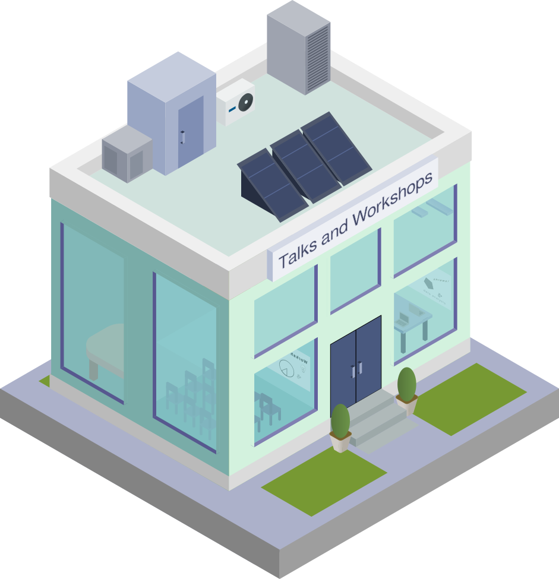

::: {.page-icon}

:::

# Teaching philosophy

The classroom is where I meet people. I feel fortunate to have met talented and passionate students who have taught me as much as I have taught them. I aim to create a student-centered and industry-connected learning environment where students actively construct knowledge through discussion, collaboration, and reflection. My teaching follows an interactive learning approach using three classroom formats: L–C (Lecturer–Class Reflection), L–I–I–C (Lecturer–Individual–Individual–Class Reflection), and L–G–G–C (Lecturer–Group–Group–Class Reflection). Rather than relying on conventional group presentations, students engage in simulations of real business activities to apply concepts in authentic contexts. I also integrate industry perspectives by inviting experts to share their experiences and discuss current business challenges with students.

# Courses taught

- Introduction to Public Relations - PR202DE01
- Crisis Management - PR402DE01
- Fundamentals of Business and Management - PR201DE02
- Media Audience Research - TT301DE02
- Principles of Marketing - 71MRKT30013
- Consumer Behavior - 71MRKT40073
- Business Analytics - 71BUSI30053
- Introduction to Marketing
- E-Commerce
- Strategic Marketing
- Introduction to International Business

# Industry engagement

In 2026, I invited C-level executives, senior managers, and academics from the following organizations to share their real-world experiences with my students.

- Milwaukee Tool Vietnam — Ms. Huong Phan, Marketing Manager
- Saigon Telecommunications Corporation — Ms. Ngoc Dung, Chief Accountant
- Teknologi MARA University (Shah Alam) — Mr. Najmi, Senior Lecturer

# Student Supervision

- In 2026, I am supervising 11 undergraduate students for their bachelor's theses.
- To date, I have supervised more than 30 undergraduate students on their bachelor's theses and 11 students during their internships.

# Teaching materials

I believe slides should support learning, not replace it. Hence, I prefer a minimalist design that encourages discussion and critical thinking. Below is one sample.

[Download my sample slide](Supply_chain_management.pdf){.btn .btn-yellow target="_blank"}

## Interactive Game: What Reputation Did You Build?
This is an example of how I use interactive activities to turn communication theories into decision-making exercises. Students take the role of a management team, respond to a series of business situations, and see how their decisions shape stakeholder perceptions over time. The activity helps students explore the difference between corporate identity—how an organization wants to be seen—and corporate reputation—how stakeholders actually see it.

```{=html}
<div id="nadia-game">

  <!-- INTRO SCREEN -->
  <div class="nadia-screen active" id="nadia-intro">

    <div class="nadia-label">CORPORATE COMMUNICATIONS</div>

    <h2>What Reputation Did You Build?</h2>

    <p>
      You are part of the management team of <strong>Nadia</strong>,
      a new consumer electronics company.
    </p>

    <div class="identity-box">
      <div class="small-heading">NADIA'S IDENTITY</div>
      <div class="identity-words">
        <span>Human</span>
        <span>Responsible</span>
        <span>Innovative</span>
      </div>
    </div>

    <p>
      Nadia wants people to see the company this way.
      But reputation is not created by words alone.
    </p>

    <p>
      Your team will face <strong>6 situations</strong>.
      Choose what Nadia should do in each situation.
    </p>

    <p class="game-note">
      There is no perfect answer. Make the decision you think is best for the company.
    </p>

    <button class="nadia-main-btn" id="nadia-start">
      Start the game
    </button>

  </div>


  <!-- GAME SCREEN -->
  <div class="nadia-screen" id="nadia-question-screen">

    <div class="game-top">

      <div>
        <div class="nadia-label">NADIA MANAGEMENT TEAM</div>
        <div id="nadia-progress-text">Situation 1 of 6</div>
      </div>

      <div class="progress-track">
        <div class="progress-fill" id="nadia-progress-bar"></div>
      </div>

    </div>

    <div class="situation-number" id="nadia-situation-number">
      SITUATION 01
    </div>

    <h2 id="nadia-question-title"></h2>

    <div class="question-body" id="nadia-question-body"></div>

    <div class="choice-grid">

      <button class="choice-card" id="nadia-choice-a">
        <span class="choice-letter">A</span>
        <span class="choice-text" id="nadia-choice-a-text"></span>
      </button>

      <button class="choice-card" id="nadia-choice-b">
        <span class="choice-letter">B</span>
        <span class="choice-text" id="nadia-choice-b-text"></span>
      </button>

    </div>

  </div>


  <!-- WAITING / REVEAL SCREEN -->
  <div class="nadia-screen" id="nadia-ready-screen">

    <div class="nadia-label">YOU HAVE MADE ALL 6 DECISIONS</div>

    <h2>So, who did Nadia become?</h2>

    <p>
      At the beginning, Nadia wanted to be:
    </p>

    <div class="identity-box compact">
      <div class="identity-words">
        <span>Human</span>
        <span>Responsible</span>
        <span>Innovative</span>
      </div>
    </div>

    <p>
      But stakeholders do not only hear what a company says.
      They watch what the company does.
    </p>

    <button class="nadia-main-btn" id="nadia-reveal">
      Reveal Nadia's reputation
    </button>

  </div>


  <!-- RESULT SCREEN -->
  <div class="nadia-screen" id="nadia-result-screen">

    <div class="nadia-label">YOUR RESULT</div>

    <h2 id="nadia-result-title"></h2>

    <p class="result-intro" id="nadia-result-description"></p>

    <div class="comparison-grid">

      <div class="comparison-card">
        <div class="small-heading">INTENDED IDENTITY</div>

        <div class="big-word">Human</div>
        <div class="big-word">Responsible</div>
        <div class="big-word">Innovative</div>
      </div>

      <div class="comparison-arrow">
        →
      </div>

      <div class="comparison-card reputation-card">
        <div class="small-heading">REPUTATION CREATED</div>
        <div id="nadia-reputation-words"></div>
      </div>

    </div>


    <div class="reputation-section">

      <h3>How stakeholders may see Nadia</h3>

      <div class="trait-grid" id="nadia-trait-grid"></div>

    </div>


    <div class="decision-section">

      <h3>Your decisions</h3>

      <div id="nadia-decision-list"></div>

    </div>


    <div class="discussion-box">

      <div class="small-heading">DISCUSS</div>

      <p>
        Nadia wanted to be
        <strong>Human, Responsible and Innovative.</strong>
      </p>

      <p>
        Did your decisions create the same reputation?
      </p>

      <p>
        <strong>
          Can communication fix the gap without changing Nadia's decisions and behaviour?
        </strong>
      </p>

    </div>

    <button class="nadia-secondary-btn" id="nadia-restart">
      Play again
    </button>

  </div>

</div>


<style>

#nadia-game {
  max-width: 900px;
  margin: 3rem auto;
  font-family: inherit;
}

#nadia-game * {
  box-sizing: border-box;
}

.nadia-screen {
  display: none;
}

.nadia-screen.active {
  display: block;
}

.nadia-label {
  font-size: 0.78rem;
  font-weight: 700;
  letter-spacing: 0.12em;
  margin-bottom: 0.8rem;
  opacity: 0.65;
}

#nadia-game h2 {
  font-size: 2rem;
  line-height: 1.2;
  margin-bottom: 1.2rem;
}

#nadia-game h3 {
  margin-top: 0;
}

.identity-box {
  margin: 2rem 0;
  padding: 1.8rem;
  border: 2px solid currentColor;
  border-radius: 14px;
}

.identity-box.compact {
  padding: 1.3rem;
}

.small-heading {
  font-size: 0.75rem;
  font-weight: 700;
  letter-spacing: 0.12em;
  opacity: 0.6;
  margin-bottom: 0.8rem;
}

.identity-words {
  display: flex;
  gap: 0.7rem;
  flex-wrap: wrap;
}

.identity-words span {
  padding: 0.6rem 1rem;
  border: 1px solid currentColor;
  border-radius: 999px;
  font-weight: 700;
  font-size: 1.05rem;
}

.game-note {
  opacity: 0.7;
  font-size: 0.95rem;
}

.nadia-main-btn,
.nadia-secondary-btn {
  margin-top: 1.4rem;
  padding: 0.85rem 1.4rem;
  border-radius: 8px;
  border: 2px solid currentColor;
  font-size: 1rem;
  font-weight: 700;
  cursor: pointer;
}

.nadia-main-btn {
  background: #111;
  color: white;
  border-color: #111;
}

.nadia-secondary-btn {
  background: transparent;
  color: inherit;
}

.game-top {
  display: flex;
  gap: 2rem;
  justify-content: space-between;
  align-items: flex-end;
  margin-bottom: 3rem;
}

.progress-track {
  width: 260px;
  height: 8px;
  background: rgba(125,125,125,0.2);
  border-radius: 999px;
  overflow: hidden;
}

.progress-fill {
  width: 0%;
  height: 100%;
  background: currentColor;
  transition: width 0.35s ease;
}

#nadia-progress-text {
  font-size: 0.9rem;
  opacity: 0.7;
}

.situation-number {
  font-size: 0.8rem;
  letter-spacing: 0.12em;
  font-weight: 700;
  opacity: 0.55;
  margin-bottom: 0.7rem;
}

.question-body {
  margin-bottom: 2rem;
  line-height: 1.65;
}

.choice-grid {
  display: grid;
  grid-template-columns: 1fr 1fr;
  gap: 1rem;
}

.choice-card {
  display: flex;
  align-items: flex-start;
  gap: 1rem;
  text-align: left;
  padding: 1.4rem;
  min-height: 130px;
  border: 2px solid rgba(120,120,120,0.35);
  border-radius: 12px;
  background: transparent;
  color: inherit;
  cursor: pointer;
  font-size: 1rem;
  line-height: 1.5;
  transition:
    transform 0.12s ease,
    border-color 0.12s ease,
    background 0.12s ease;
}

.choice-card:hover {
  transform: translateY(-2px);
  border-color: currentColor;
  background: rgba(125,125,125,0.08);
}

.choice-letter {
  min-width: 34px;
  height: 34px;
  border: 2px solid currentColor;
  border-radius: 50%;
  display: inline-flex;
  justify-content: center;
  align-items: center;
  font-weight: 800;
}

.comparison-grid {
  display: grid;
  grid-template-columns: 1fr auto 1fr;
  gap: 1.4rem;
  align-items: center;
  margin: 2.5rem 0;
}

.comparison-card {
  padding: 1.5rem;
  border: 2px solid rgba(120,120,120,0.35);
  border-radius: 12px;
}

.reputation-card {
  border-color: currentColor;
}

.comparison-arrow {
  font-size: 2rem;
}

.big-word {
  font-size: 1.35rem;
  font-weight: 700;
  margin: 0.45rem 0;
}

.result-reputation-word {
  font-size: 1.35rem;
  font-weight: 700;
  margin: 0.45rem 0;
}

.reputation-section,
.decision-section {
  margin-top: 2.5rem;
}

.trait-grid {
  display: grid;
  grid-template-columns: repeat(2, 1fr);
  gap: 0.8rem;
}

.trait-item {
  border: 1px solid rgba(120,120,120,0.35);
  border-radius: 10px;
  padding: 1rem;
}

.trait-name {
  font-weight: 700;
}

.trait-bar {
  margin-top: 0.7rem;
  height: 7px;
  background: rgba(120,120,120,0.18);
  border-radius: 999px;
  overflow: hidden;
}

.trait-bar-fill {
  height: 100%;
  background: currentColor;
}

.decision-item {
  display: grid;
  grid-template-columns: 45px 1fr;
  gap: 1rem;
  padding: 1rem 0;
  border-bottom: 1px solid rgba(120,120,120,0.22);
}

.decision-choice {
  font-weight: 800;
  font-size: 1.1rem;
}

.decision-title {
  font-weight: 700;
  margin-bottom: 0.25rem;
}

.decision-effect {
  font-size: 0.92rem;
  opacity: 0.7;
}

.discussion-box {
  margin-top: 3rem;
  padding: 1.6rem;
  border-left: 5px solid currentColor;
  background: rgba(125,125,125,0.08);
}

.result-intro {
  font-size: 1.1rem;
  max-width: 700px;
}

@media (max-width: 700px) {

  .choice-grid {
    grid-template-columns: 1fr;
  }

  .comparison-grid {
    grid-template-columns: 1fr;
  }

  .comparison-arrow {
    transform: rotate(90deg);
    text-align: center;
  }

  .trait-grid {
    grid-template-columns: 1fr;
  }

  .game-top {
    display: block;
  }

  .progress-track {
    width: 100%;
    margin-top: 1rem;
  }

}

</style>


<script>

(function () {

  const questions = [

    {
      title: "The New Product",
      body: `
        <p>
          Nadia launches a new smartphone. The company sees it as
          <strong>premium, modern and different.</strong>
        </p>

        <p>
          But online comments are mostly negative:
          “Too expensive”, “The design is ugly”, and
          “Why would anyone buy this?”
        </p>

        <p>
          The product team still believes strongly in the product.
        </p>
      `,
      a: "Listen to the feedback, review the price and design, and tell customers that Nadia will learn from the launch.",
      b: "Stand behind the product and explain that customers may need time to understand Nadia's new design direction.",

      scoreA: {
        human: 2,
        responsible: 1,
        innovative: 0,
        customer: 3,
        confidence: -1,
        aggressive: -1
      },

      scoreB: {
        human: -1,
        responsible: 0,
        innovative: 2,
        customer: -2,
        confidence: 3,
        aggressive: 1
      },

      effectA: "Nadia listened and responded to customers.",
      effectB: "Nadia protected its vision, but some customers may feel that the company does not listen."
    },


    {
      title: "A Popular Feature Is Removed",
      body: `
        <p>
          Nadia removes the headphone port from its next phone.
          The design team says this makes the phone thinner and supports
          Nadia's move toward wireless technology.
        </p>

        <p>
          Many existing customers complain that they still use wired headphones.
        </p>
      `,
      a: "Keep the change, but include an adapter and clearly explain why Nadia made the decision.",
      b: "Bring the headphone port back because many existing customers still want it.",

      scoreA: {
        human: 1,
        responsible: 1,
        innovative: 3,
        customer: 1,
        confidence: 2,
        aggressive: 0
      },

      scoreB: {
        human: 2,
        responsible: 1,
        innovative: -1,
        customer: 3,
        confidence: -1,
        aggressive: -1
      },

      effectA: "Nadia continued its innovation while giving customers some support.",
      effectB: "Nadia responded strongly to customer preferences, but stepped back from its original innovation."
    },


    {
      title: "An Employee Speaks Online",
      body: `
        <p>
          An employee posts online that staff have been working very long hours
          before Nadia's next product launch.
        </p>

        <p>
          The post starts receiving attention.
        </p>
      `,
      a: "Meet with employees, review the workload, and publicly say that Nadia is looking into the concern.",
      b: "Handle the issue internally and remind employees that workplace matters should not be discussed online.",

      scoreA: {
        human: 3,
        responsible: 2,
        innovative: 0,
        customer: 0,
        confidence: 0,
        aggressive: -1
      },

      scoreB: {
        human: -2,
        responsible: -1,
        innovative: 0,
        customer: 0,
        confidence: 2,
        aggressive: 2
      },

      effectA: "Nadia showed concern for employees and accepted public attention.",
      effectB: "Nadia kept tighter control over internal matters, but may appear less open."
    },


    {
      title: "The Sustainability Message",
      body: `
        <p>
          Around 80% of Nadia's new packaging uses sustainable materials.
        </p>

        <p>
          The marketing team wants a short, powerful message.
        </p>
      `,
      a: "Say: “80% sustainable materials — and we are working on the rest.”",
      b: "Say: “Designed for a more sustainable future.”",

      scoreA: {
        human: 1,
        responsible: 3,
        innovative: 0,
        customer: 1,
        confidence: 0,
        aggressive: -1
      },

      scoreB: {
        human: 0,
        responsible: 0,
        innovative: 1,
        customer: 0,
        confidence: 2,
        aggressive: 0
      },

      effectA: "Nadia used a specific and transparent claim.",
      effectB: "Nadia used a stronger brand message, but gave customers less detail."
    },


    {
      title: "A Competitor Attacks Nadia",
      body: `
        <p>
          A competitor posts that Nadia's new phone looks very similar
          to one of its products.
        </p>

        <p>
          The post receives thousands of comments.
        </p>
      `,
      a: "Show Nadia's design process and explain the differences between the two products.",
      b: "Reply with a funny social media post comparing Nadia's newer features with the competitor's older technology.",

      scoreA: {
        human: 1,
        responsible: 2,
        innovative: 1,
        customer: 0,
        confidence: 2,
        aggressive: -1
      },

      scoreB: {
        human: 0,
        responsible: -1,
        innovative: 2,
        customer: 1,
        confidence: 3,
        aggressive: 3
      },

      effectA: "Nadia responded with evidence and kept the conversation professional.",
      effectB: "Nadia appeared bold and confident, but also more aggressive."
    },


    {
      title: "AI Customer Service",
      body: `
        <p>
          Nadia can cut customer-service costs by 15% by using AI
          for most customer questions.
        </p>

        <p>
          The AI system is fast and works well for common problems,
          but some customers still prefer speaking with a person.
        </p>
      `,
      a: "Use AI for simple questions and keep human staff for more difficult cases.",
      b: "Move most customer service to AI because it is faster, cheaper and available 24/7.",

      scoreA: {
        human: 3,
        responsible: 2,
        innovative: 2,
        customer: 3,
        confidence: 0,
        aggressive: -1
      },

      scoreB: {
        human: -2,
        responsible: 0,
        innovative: 3,
        customer: -1,
        confidence: 2,
        aggressive: 1
      },

      effectA: "Nadia used new technology while keeping human support.",
      effectB: "Nadia moved quickly toward AI and efficiency, but some customers may feel less valued."
    }

  ];


  let currentQuestion = 0;
  let answers = [];

  let score = {
    human: 0,
    responsible: 0,
    innovative: 0,
    customer: 0,
    confidence: 0,
    aggressive: 0
  };


  const introScreen =
    document.getElementById("nadia-intro");

  const questionScreen =
    document.getElementById("nadia-question-screen");

  const readyScreen =
    document.getElementById("nadia-ready-screen");

  const resultScreen =
    document.getElementById("nadia-result-screen");


  function showScreen(screen) {

    document
      .querySelectorAll("#nadia-game .nadia-screen")
      .forEach(function (item) {
        item.classList.remove("active");
      });

    screen.classList.add("active");

  }


  function renderQuestion() {

    const q = questions[currentQuestion];

    document.getElementById(
      "nadia-progress-text"
    ).textContent =
      "Situation " +
      (currentQuestion + 1) +
      " of " +
      questions.length;


    document.getElementById(
      "nadia-progress-bar"
    ).style.width =
      ((currentQuestion + 1) / questions.length * 100) + "%";


    document.getElementById(
      "nadia-situation-number"
    ).textContent =
      "SITUATION " +
      String(currentQuestion + 1).padStart(2, "0");


    document.getElementById(
      "nadia-question-title"
    ).textContent = q.title;


    document.getElementById(
      "nadia-question-body"
    ).innerHTML = q.body;


    document.getElementById(
      "nadia-choice-a-text"
    ).textContent = q.a;


    document.getElementById(
      "nadia-choice-b-text"
    ).textContent = q.b;

  }


  function addScore(points) {

    Object.keys(points).forEach(function (key) {
      score[key] += points[key];
    });

  }


  function choose(option) {

    const q = questions[currentQuestion];

    if (option === "A") {

      addScore(q.scoreA);

      answers.push({
        number: currentQuestion + 1,
        title: q.title,
        choice: "A",
        text: q.a,
        effect: q.effectA
      });

    } else {

      addScore(q.scoreB);

      answers.push({
        number: currentQuestion + 1,
        title: q.title,
        choice: "B",
        text: q.b,
        effect: q.effectB
      });

    }


    currentQuestion++;


    if (currentQuestion < questions.length) {

      renderQuestion();

      window.scrollTo({
        top: document
          .getElementById("nadia-game")
          .offsetTop - 30,
        behavior: "smooth"
      });

    } else {

      showScreen(readyScreen);

    }

  }


  function getResult() {

    const peopleScore =
      score.human +
      score.customer +
      score.responsible;

    const performanceScore =
      score.confidence +
      score.innovative +
      score.aggressive;


    if (
      score.human >= 7 &&
      score.responsible >= 7 &&
      score.innovative >= 5
    ) {

      return {
        title: "The Trusted Innovator",
        description:
          "Nadia appears open to change, but it also pays attention to people and the impact of its decisions.",
        words: [
          "Human",
          "Responsible",
          "Forward-looking"
        ]
      };

    }


    if (
      score.customer >= 8 &&
      score.confidence <= 5
    ) {

      return {
        title: "The Customer-First Company",
        description:
          "Nadia listens closely to customers and adjusts quickly. Some people may question whether the company always stands firmly behind its own direction.",
        words: [
          "Responsive",
          "Caring",
          "Customer-focused"
        ]
      };

    }


    if (
      score.aggressive >= 5 &&
      score.confidence >= 8
    ) {

      return {
        title: "The Bold Competitor",
        description:
          "Nadia appears confident, fast and willing to challenge others. Some stakeholders may also see the company as aggressive or difficult to question.",
        words: [
          "Bold",
          "Competitive",
          "Aggressive"
        ]
      };

    }


    if (
      score.innovative >= 9 &&
      score.human <= 3
    ) {

      return {
        title: "The Technology-First Company",
        description:
          "Nadia strongly believes in technology and change. The company looks innovative, but some stakeholders may feel that efficiency matters more than people.",
        words: [
          "Innovative",
          "Efficient",
          "Less human"
        ]
      };

    }


    if (
      performanceScore >
      peopleScore + 5
    ) {

      return {
        title: "The Performance Machine",
        description:
          "Nadia appears confident, efficient and focused on results. The original promise of being human and responsible is less visible.",
        words: [
          "Efficient",
          "Confident",
          "Performance-focused"
        ]
      };

    }


    if (
      peopleScore >
      performanceScore + 8
    ) {

      return {
        title: "The Careful Listener",
        description:
          "Nadia appears thoughtful, responsible and willing to listen. Some stakeholders may see the company as less bold than its innovative identity suggests.",
        words: [
          "Caring",
          "Responsible",
          "Cautious"
        ]
      };

    }


    return {
      title: "The Corporate Balancer",
      description:
        "Nadia tries to balance innovation, business performance and stakeholder expectations. The result is fairly balanced, but its identity may not always be clear.",
      words: [
        "Practical",
        "Balanced",
        "Flexible"
      ]
    };

  }


  function scoreToPercent(value, min, max) {

    const result =
      ((value - min) / (max - min)) * 100;

    return Math.max(
      5,
      Math.min(100, result)
    );

  }


  function revealResult() {

    const result = getResult();


    document.getElementById(
      "nadia-result-title"
    ).textContent = result.title;


    document.getElementById(
      "nadia-result-description"
    ).textContent = result.description;


    document.getElementById(
      "nadia-reputation-words"
    ).innerHTML =
      result.words
        .map(function (word) {
          return (
            '<div class="result-reputation-word">' +
            word +
            "</div>"
          );
        })
        .join("");


    const traits = [

      {
        name: "Human",
        value: score.human,
        min: -5,
        max: 15
      },

      {
        name: "Responsible",
        value: score.responsible,
        min: -5,
        max: 15
      },

      {
        name: "Innovative",
        value: score.innovative,
        min: -5,
        max: 15
      },

      {
        name: "Customer-focused",
        value: score.customer,
        min: -5,
        max: 15
      },

      {
        name: "Confident",
        value: score.confidence,
        min: -5,
        max: 15
      },

      {
        name: "Aggressive",
        value: score.aggressive,
        min: -5,
        max: 15
      }

    ];


    document.getElementById(
      "nadia-trait-grid"
    ).innerHTML =
      traits
        .map(function (trait) {

          const width =
            scoreToPercent(
              trait.value,
              trait.min,
              trait.max
            );

          return `
            <div class="trait-item">

              <div class="trait-name">
                ${trait.name}
              </div>

              <div class="trait-bar">
                <div
                  class="trait-bar-fill"
                  style="width:${width}%">
                </div>
              </div>

            </div>
          `;

        })
        .join("");


    document.getElementById(
      "nadia-decision-list"
    ).innerHTML =
      answers
        .map(function (answer) {

          return `
            <div class="decision-item">

              <div class="decision-choice">
                ${answer.choice}
              </div>

              <div>

                <div class="decision-title">
                  ${answer.number}. ${answer.title}
                </div>

                <div>
                  ${answer.text}
                </div>

                <div class="decision-effect">
                  ${answer.effect}
                </div>

              </div>

            </div>
          `;

        })
        .join("");


    showScreen(resultScreen);

  }


  function restartGame() {

    currentQuestion = 0;
    answers = [];

    score = {
      human: 0,
      responsible: 0,
      innovative: 0,
      customer: 0,
      confidence: 0,
      aggressive: 0
    };

    showScreen(introScreen);

  }


  document
    .getElementById("nadia-start")
    .addEventListener(
      "click",
      function () {

        currentQuestion = 0;

        renderQuestion();

        showScreen(questionScreen);

      }
    );


  document
    .getElementById("nadia-choice-a")
    .addEventListener(
      "click",
      function () {
        choose("A");
      }
    );


  document
    .getElementById("nadia-choice-b")
    .addEventListener(
      "click",
      function () {
        choose("B");
      }
    );


  document
    .getElementById("nadia-reveal")
    .addEventListener(
      "click",
      revealResult
    );


  document
    .getElementById("nadia-restart")
    .addEventListener(
      "click",
      restartGame
    );

})();
</script>
```