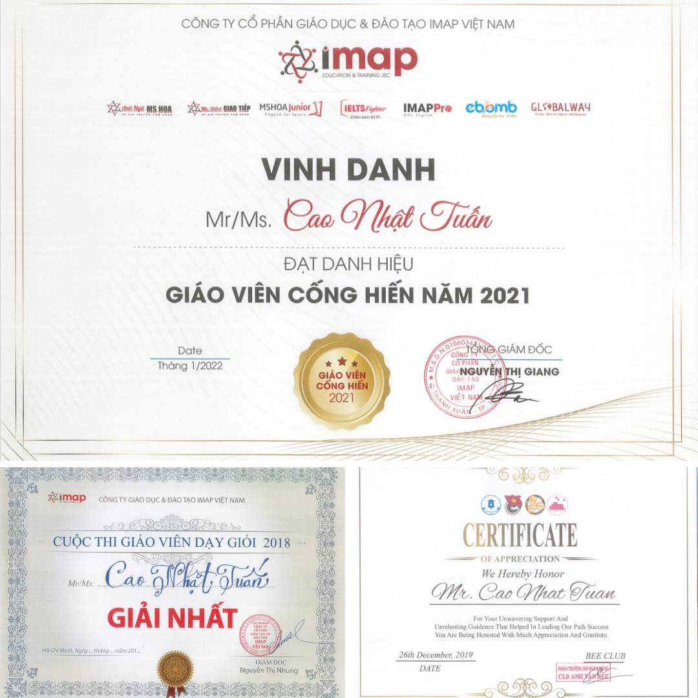

## Scholarships
I have been fortunate to receive multiple scholarships and research grants that recognize both my academic excellence and research potential. These include full scholarships at the Master’s and PhD levels as well as competitive national and international research funding [(Table 2)](#fund).

:::{#tab-fund}

*Table 2. Scholarships and Research Funding*

| Year       | Amount (USD)    | Scholarship and Funding                                                                 |
|---------------|--------------------|-----------------------------------------------------------------------------------|
| 2017–2019  | 3,000           | Awarded a full scholarship to pursue the Master’s program at Open University Vietnam     |
| 2024–2026  | 123,600         | Full scholarship for the Cotutelle PhD at the University of Southern Queensland, Australia, and Open University Vietnam |
| 2024       | 20,000          | Research funding from the Ministry of Education and Training (Grant B2024-MBS-09)       |
| 2025       | 160,000 (est.)  | Research funding from NAFOSTED (second round)                                           |

:::

## Awards

Below are some of my academic awards, beginning with the recognition I received in 2017 for achieving the highest entrance examination score [(Figure 8)](#aw1). 

{#aw1 width="60%" fig-align="center"}

I went on to achieve the highest GPA in the program, a reflection of consistent performance across all subjects [(Figure 9)](#aw2).

{#aw2 width="60%" fig-align="center"}

This excellence was honored with the university’s Top Graduate Award, often referred to as the Valedictorian prize [(Figure 10)](#aw2).

{#aw3 width="60%" fig-align="center"}

Finally, I also received several other recognitions for my academic contributions and professional work, which further shaped my growth as both a researcher and an educator [(Figure 11)](#aw4).

{#aw4 width="60%" fig-align="center"}