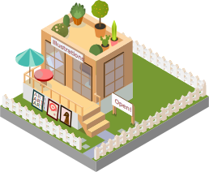

::: {.page-icon}

:::

Not everything I do ends up in a journal article or classroom. Along the way, I have worked on a range of freelance projects, each with its own story, challenges, and lessons.

## First Project

In 2011, I started a speaker team at an English center to create opportunities for learners to practice English outside the classroom. What began with three members grew into a 20-member team by 2013 and achieved a student satisfaction rating of 4.5 out of 5. It was one of the first projects that showed me how ideas can grow when people share a common purpose.

{#yume width="60%" fig-align="center"}

## Second Project

In 2012, I managed a Couchsurfing house that hosted travelers from across the globe. For a few years, it became a place where people from different countries, cultures, and walks of life crossed paths. Every guest brought a new story, making the house feel like a small window into a much larger world.

{#lu width="60%" fig-align="center"}

## Third Project

In 2014, I began my freelance marketing journey by working with beauty vlogger Góc của Rư. My role focused on offline activities, including planning agendas for fan meetings and makeup classes. Behind every successful event are many small pieces working together, and I was fortunate to be one of them. The experience gave me my first glimpse into influencer marketing long before it became a mainstream industry.

{#ru width="60%" fig-align="center"}

## Fourth Project

From late 2014 to 2015, I began organizing marketing events on my own. One of my first projects was an outdoor event for Cali Elementary School, which welcomed nearly 80 guests. I coordinated external partners, including a live band and an MC, and worked with local authorities to secure the necessary permits. The event was well received, leading the school owner to invite me to organize two additional events at her other campuses in Go Vap and Thu Duc.

{#cali width="60%" fig-align="center"}

## Fifth Project

In 2015, I noticed how much Vietnamese learners enjoyed practicing English through real conversations with foreigners. Inspired by this, I created a local version of The Amazing Race and invited 24 participants to join the adventure. Divided into four teams, they solved clues that guided them across five locations in Ho Chi Minh City, while working together with foreign travelers to complete a series of challenges. Looking back, it was one of my favorite projects because it combined learning, exploration, and human connection into a single experience.

{#race width="60%" fig-align="center"}

## Sixth Project

In 2015, I had the opportunity to lead the organization of the 5-year anniversary celebration for the non-profit language center Leaf Pagoda. From early planning and preparation to coordinating activities on the day itself, I was involved in every stage of the event. It was one of the first projects that showed me how many moving pieces come together behind the scenes to create a memorable experience.

{#leaf width="60%" fig-align="center"}

## Other Projects

Beyond these six projects, I explored many other paths as well: teaching on television, helping a clinic attract investment, managing a fast-food store, and directing a stage play, among others. Each experience added a different chapter to my story. Some lasted only a few months, while others changed the direction of my journey entirely. Together, they form a collection of memories, lessons, and adventures that continue to shape the person I am today.

{#others width="60%" fig-align="center"}

One project that remains memorable was directing the stage play Wukong Re-Spring. We reimagined a familiar story, assembled a diverse creative team, and transformed a simple concept into a live performance.

  

